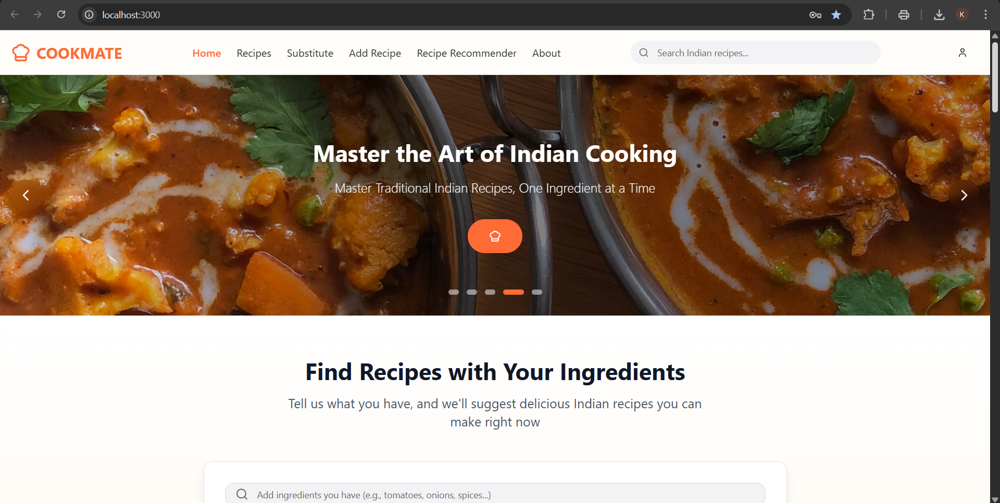

<div align="center">

# 🍳 𝘾𝙤𝙤𝙠𝙈𝙖𝙩𝙚 – 𝙎𝙢𝙖𝙧𝙩 𝙄𝙣𝙜𝙧𝙚𝙙𝙞𝙚𝙣𝙩-𝘽𝙖𝙨𝙚𝙙 𝙍𝙚𝙘𝙞𝙥𝙚 𝙁𝙞𝙣𝙙𝙚𝙧

✨ *Cook Smart. Waste Less. Eat Better.* ✨  
>
> 
>

</div>

---

## 🥘 What is CookMate?

**CookMate** is an AI-powered recipe recommendation platform that helps you decide *what to cook* using the **ingredients already available in your kitchen**.

Missing an ingredient? CookMate suggests the **best substitutes**.  
Cooking for more or fewer people? It **auto-adjusts servings**.  
Confused about what matches best? It shows **ML-powered match percentages**.

A perfect tool for:
- Home cooks  
- Students & hostelers  
- Busy families  
- Anyone who wants quicker, smarter cooking  

---

## 💡 Key Features

✨ **Smart Ingredient-Based Recipe Finder**  
✨ **Automatic Ingredient Substitutions**  
✨ **Portion & Serving Adjustment**  
✨ **Random Forest ML Model for Recipe Matching**  
✨ **Fast, Clean, Modern UI (React)**  
✨ **Secure & Scalable Backend (Django REST API)**  

---

## ⚙️ Tech Stack

- **React.js + Tailwind CSS** — UI  
- **Django + Django REST Framework** — Backend  
- **Python (NumPy, Pandas)** — ML Processing  
- **Random Forest Classifier** — Recipe matching model  
- **MySQL / SQLite** — Database  

---

## 📸 Screenshots

### 🏠 Home Page  


### 🥗 Recipes Exploration Page 


### 🧂 Ingredient Input  


### 📄 Recommended Recipe Details  


---

## 🎥 Demo Video

<p align="center">
  <a href="[https://www.youtube.com/watch?v=YOUR_VIDEO_LINK](https://youtu.be/xN0vvrhbIII?si=aC-GI_9AaOgfzi1m)" target="_blank">
    
  </a>
</p>

> 🎬 Click the thumbnail above to watch the full walkthrough.

---

## 🗂️ Project Structure

CookMate/

│

├── backend/

│ ├── cookmate/

│ ├── api/

│ ├── ml_model/

│ ├── db.sqlite3

│ └── manage.py

│
├── frontend/

│ ├── src/

│ ├── public/

│ └── package.json

│
├── images/

└── README.md


---

## 🧩 Installation & Setup

### 1️⃣ Clone the repository  
git clone 
https://github.com/Kanishka-Wani/CookMate

cd CookMate

### 1️⃣ Backend Setup
cd backend

pip install -r requirements.txt

python manage.py migrate

python manage.py runserver


### 1️⃣ Frontend Setup

cd frontend

npm install

npm run dev


---

### 📦 Download / Explore

🔗 GitHub Repository

https://github.com/Kanishka-Wani/CookMate


👉 View code, raise issues, contribute, or fork the project!

---
### 👨‍💻 Author

Kanishka Dinesh Wani

GitHub: https://github.com/Kanishka-Wani

Email: kanishkawani52@gmail.com

---
### 🙏 Acknowledgements

🍽️ Open-source food recipe datasets

🧪 Scientific Python libraries

🎨 Icons & UI inspirations from open-source community

---
<div align="center">
---
“Good food is the foundation of genuine happiness.”
— Auguste Escoffier
---
🍳 Crafted with passion by Kanishka Wani

</div> ```
